# Mermaid Diagrams Skill

This skill provides:
- A conservative set of Mermaid templates that render on older renderers (VS Code/Markdown previewers, Git platforms) and remain clear to humans.
- Guidance on which diagram type to use for which situation.
- Compatibility tips and fallbacks when advanced Mermaid types are unavailable.

## Compatibility Rules (Read First)
- Prefer `graph LR`/`graph TB` for flowcharts; some renderers fail on `flowchart` keyword.
- Quote labels containing spaces/special characters: `A["Text (x|y) |"]`.
- **Do not use literal `\n` inside labels** — Mermaid does not interpret such line breaks. Use `<br/>` for line breaks.
- Advanced types like `quadrantChart`, `sankey-beta`, `requirementDiagram`, `gitGraph` may not be available. Use provided flowchart fallbacks.
- Code fences must start at column 0 with language `mermaid`.

## ASCII/Unicode Sidecar (Human-Readable Raw Markdown)
To optimize for quick human scanning in raw Markdown and robust parsing by agents, always ship an ASCII/Unicode sidecar immediately below each Mermaid block.

Policy:
- MUST include a monospace, text-only diagram right under the Mermaid block using fenced code with language `text`.
- MUST keep Mermaid and sidecar in sync (same nodes/edges, same labels where feasible). If they diverge, treat Mermaid as the source of truth and update the sidecar.
- SHOULD limit width to ~80 columns for readability in diffs and terminals.
- SHOULD use simple line art characters (ASCII first; Unicode box-drawing optional when environment supports it).
- MAY add a one-line caption above the pair: `Diagram: <name> (<type>)`.

Recommended primitives:
- Boxes: `[Name]`, `(Name)`, `+-----+\n| N |\n+-----+`
- Flows: `-->`, decisions as `{cond?}` lines, lists with `-`.
- Sequence (text-based): `Actor -> Actor: message` with indented lifelines.

Example (Flowchart):
```mermaid
graph LR
  A["Start"] --> B{Auth?}
  B -->|Yes| C["Dashboard"]
  B -->|No|  D["Login"]
```
```text
Diagram: Auth flow (flowchart)
  [Start] --> {Auth?}
      {Auth?} -- Yes --> [Dashboard]
      {Auth?} -- No  --> [Login]
```

Example (Text-based Sequence):
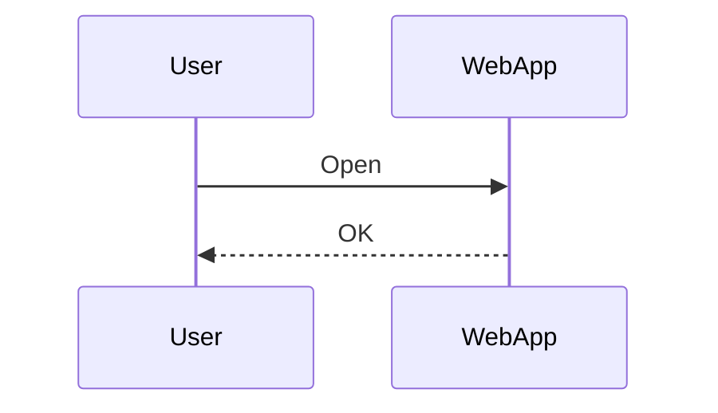
```text
Diagram: Happy path (sequence)
  User -> WebApp : Open
  WebApp -> User : OK
```

## Working Templates (Renderer-Compatible)

### Flowchart
```mermaid
graph LR
  A["Start"] --> B{Auth?}
  B -->|Yes| C["Dashboard"]
  B -->|No|  D["Login"]
  C --> E["Settings"]
```

### Sequence
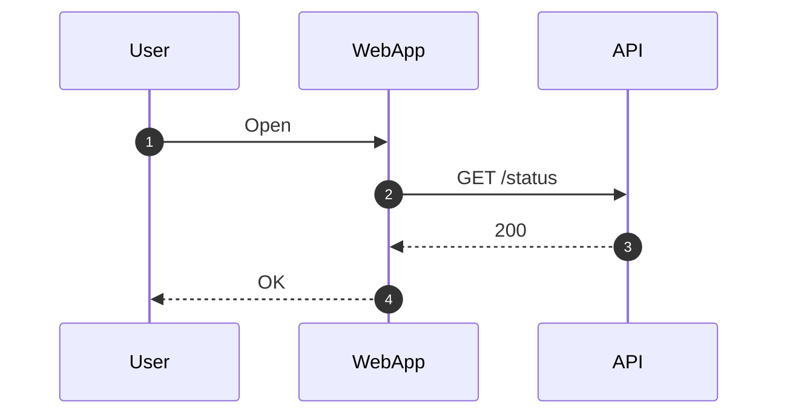

### Class
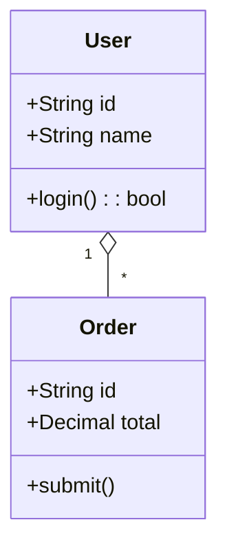

### State (v2)
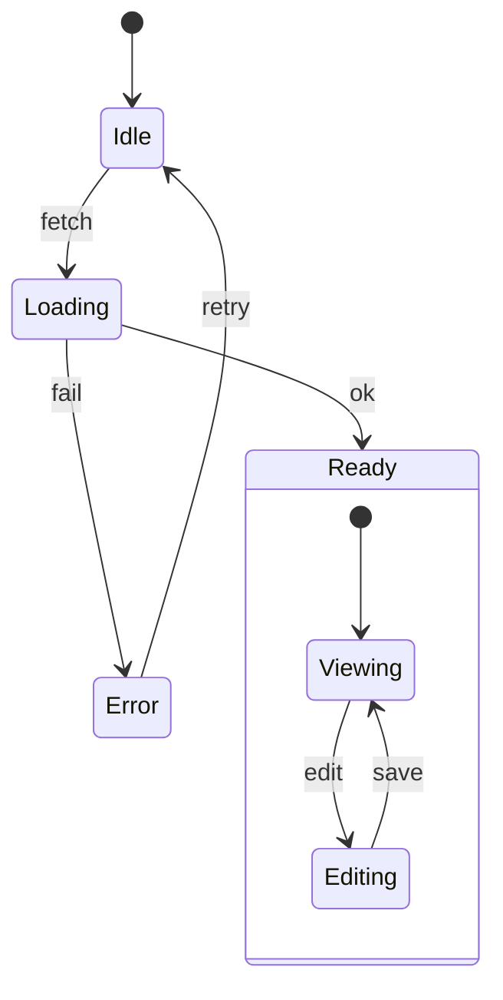

### ER (Entity-Relationship)
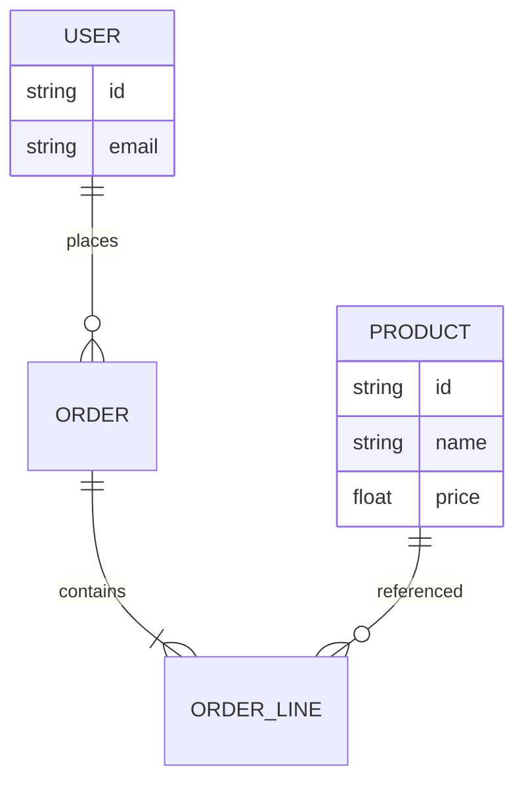

### Journey (User Journey)
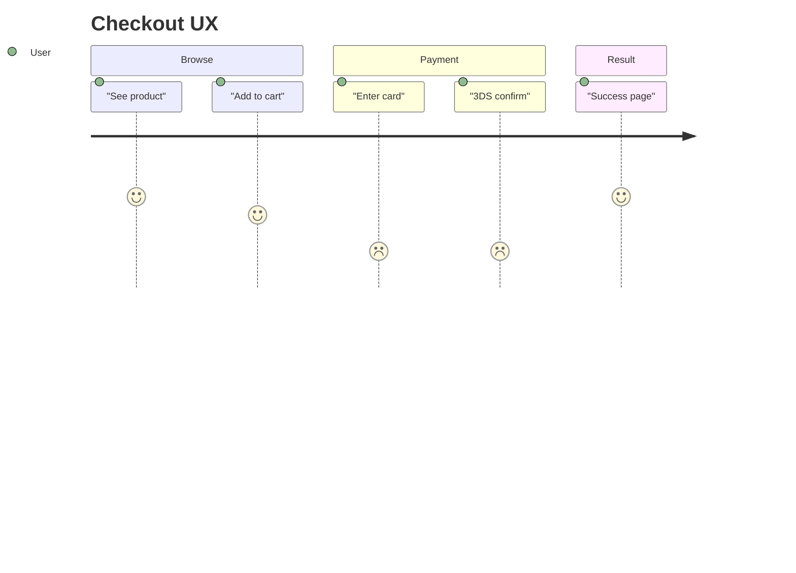

### Gantt
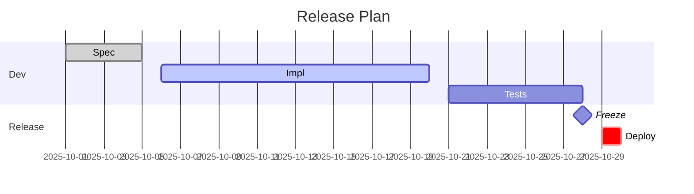

### Pie (compatible syntax)
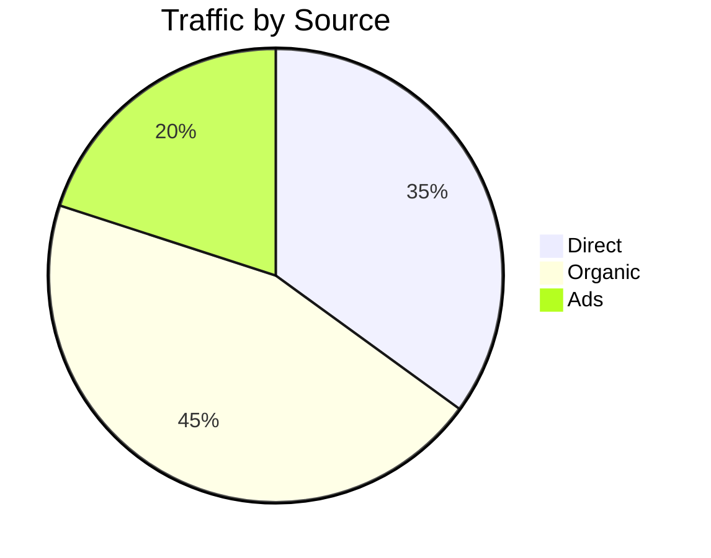

### Quadrant — flowchart fallback
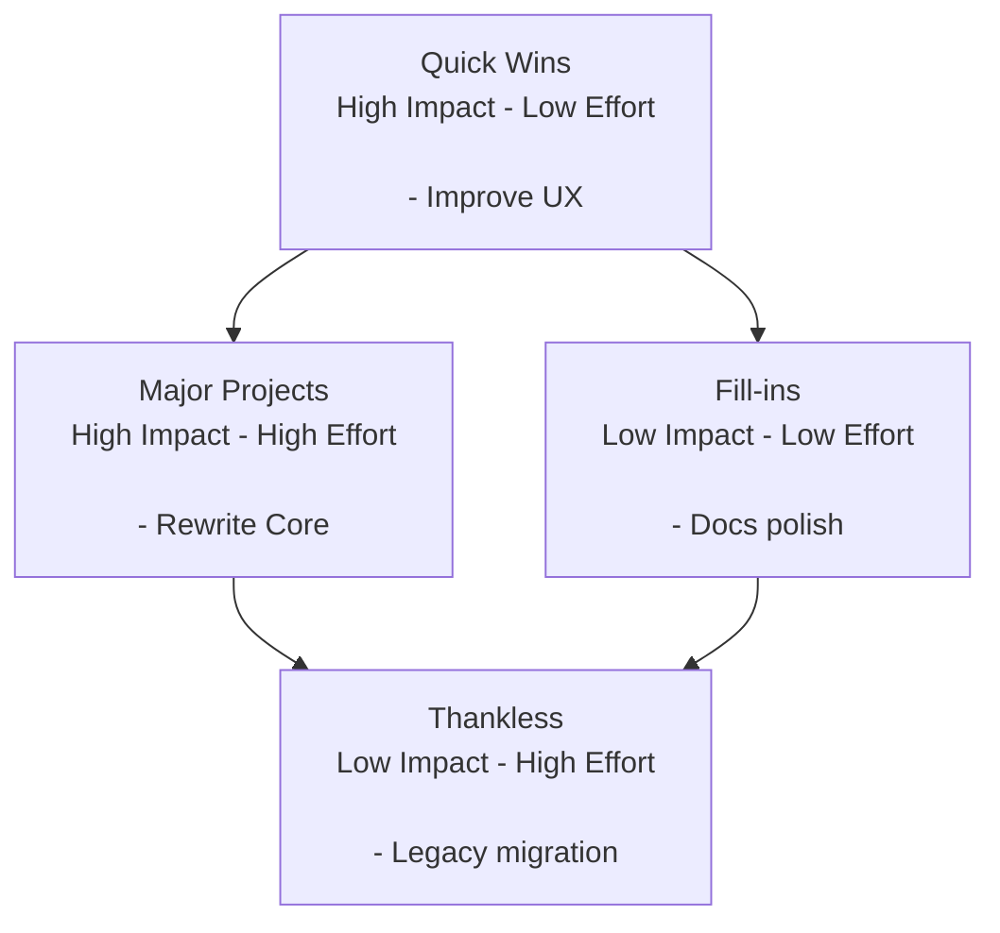

### Requirement — flowchart fallback
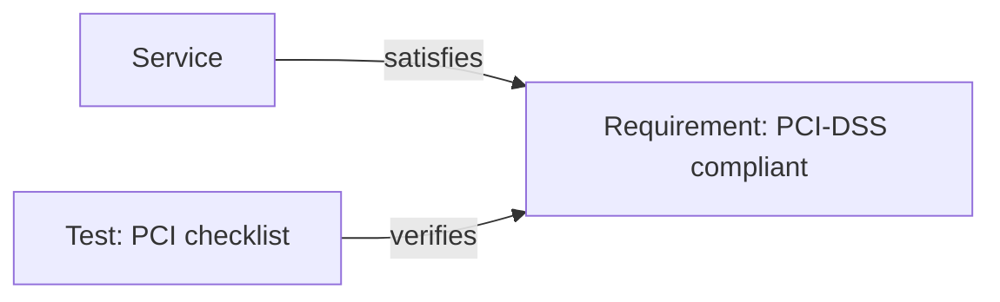

### Sankey — flowchart fallback (weights on edges)
```mermaid
graph LR
  Checkout["Checkout"] -->|100| PSP["PSP"]
  PSP -->|60|  Settled["Settled"]
  PSP -->|40|  Declined["Declined"]
```

### Git graph — flowchart fallback (simple DAG)
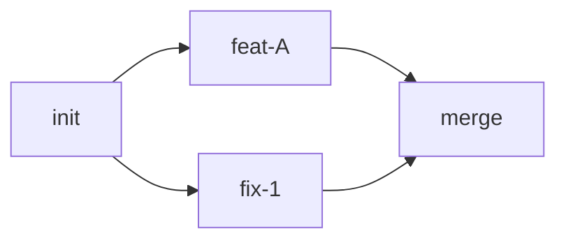

## When to Use Which Diagram
- Flowchart: General flows, decisions, and data movement in specs and PRDs.
- Sequence: Interactions over time between actors/services (APIs, requests, responses).
- Class: Domain models and static structure; useful for entity attributes and relations.
- State: Lifecycle of an entity/component (idle -> loading -> ready/error, nested states).
- ER: Database/logical data model with cardinalities.
- Journey: User experience across steps/sections (great for PRD acceptance flows).
- Gantt: Scheduling, releases, and dependencies by dates.
- Pie: Simple composition/ratios; prefer tables when precision matters.
- Quadrant (fallback): Prioritization matrix (Impact/Effort) without experimental chart support.
- Requirement (fallback): Traceability between requirements, tests, and system elements.
- Sankey (fallback): Convey relative volumes along a path when `sankey` is unavailable.
- Git graph (fallback): Small branch/merge DAGs when `gitGraph` is unavailable.

## Troubleshooting
- If a diagram fails to render, try:
  1) Replace `flowchart` with `graph` and simplify shapes.
  2) Quote node texts.
  3) Test in `https://mermaid.live` to isolate environment issues.
  4) Fall back to the templates above for maximum compatibility.
